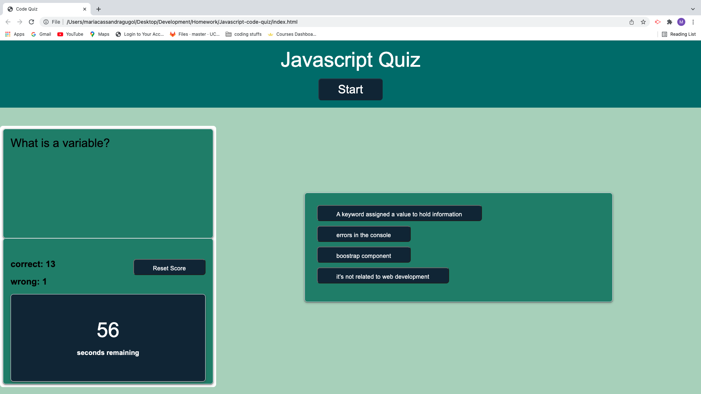

# Javascript-code-quiz
This app is a timed quiz with javascript questions. It was created used HTML, CSS, and Javascript.

## How it works  
1. Press the start button.  
2. Click your choice for answers.
3. If you pick the correct answer your "correct" score increases.  
4. If you pick the incorrect answer you "wrong" score increases. 

  

GitHub repo: 
